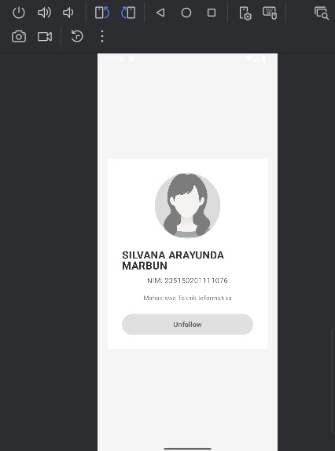
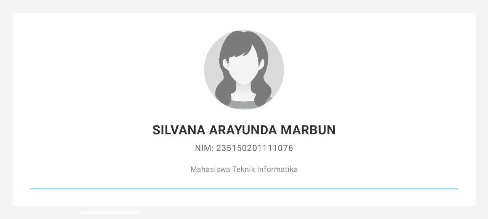

# ProfilApp - Aplikasi Profil Mahasiswa

## Informasi Mahasiswa
- **Nama**: SILVANA ARAYUNDA MARBUN
- **NIM**: 235150201111076
- **Kelas**: PAPB - B
- **Praktikum**: Pemrograman Aplikasi Perangkat Bergerak - BAB 2

---

## Deskripsi Aplikasi

Aplikasi ProfilApp adalah aplikasi sederhana yang menampilkan profil mahasiswa dengan fitur interaktif tombol Follow/Unfollow. Aplikasi ini dibuat menggunakan Jetpack Compose sebagai bagian dari tugas praktikum BAB 2.

---

## Penjelasan Singkat Kode

### **1. MainActivity.kt**
File utama aplikasi yang berisi semua komponen UI dan logic.

**Struktur Kode:**

```kotlin
class MainActivity : ComponentActivity() {
    override fun onCreate(savedInstanceState: Bundle?) {
        super.onCreate(savedInstanceState)
        setContent {
            ProfilAppTheme {
                ProfilScreen()
            }
        }
    }
}
```
- `MainActivity` adalah activity utama yang memanggil `ProfilScreen()` di dalam `setContent`
- `setContent` adalah entry point untuk menampilkan UI Compose

### **2. ProfilScreen() Function**

```kotlin
@Composable
fun ProfilScreen() {
    Column(
        horizontalAlignment = Alignment.CenterHorizontally,
        verticalArrangement = Arrangement.Center,
        modifier = Modifier.fillMaxSize()
    ) {
        // Image, Text, Button
    }
}
```

**Komponen yang digunakan:**
- **Column**: Layout vertikal untuk menyusun semua komponen dari atas ke bawah
- **Image**: Menampilkan foto profil dengan bentuk lingkaran menggunakan `clip(CircleShape)`
- **Text**: Menampilkan nama lengkap, NIM, dan deskripsi mahasiswa
- **Spacer**: Memberikan jarak vertikal antar komponen agar tidak terlalu rapat
- **FollowButton**: Tombol interaktif yang memanggil function terpisah

**Modifier yang digunakan:**
- `fillMaxSize()`: Mengisi seluruh layar
- `padding(24.dp)`: Memberikan jarak 24dp dari tepi layar
- `background(Color.White)`: Memberikan warna latar putih pada container profil
- `size(150.dp)`: Mengatur ukuran foto profil 150x150dp
- `clip(CircleShape)`: Membuat foto berbentuk lingkaran

### **3. FollowButton() Function**

```kotlin
@Composable
fun FollowButton() {
    var isFollowed by remember { mutableStateOf(false) }
    
    Button(onClick = { isFollowed = !isFollowed }) {
        Text(if (isFollowed) "Unfollow" else "Follow")
    }
}
```

**Cara kerja:**
- **remember { mutableStateOf(false) }**: Menyimpan state apakah user sudah follow atau belum
- **onClick**: Ketika tombol diklik, nilai `isFollowed` di-toggle (true ↔ false)
- **Conditional Text**: Teks tombol berubah otomatis tergantung nilai `isFollowed`
- Jika `isFollowed = false` → tampil "Follow"
- Jika `isFollowed = true` → tampil "Unfollow"

**State Management:**
Compose otomatis me-render ulang UI ketika state berubah, jadi tombol langsung update tanpa perlu manual refresh.

---

## Analisis Keuntungan Compose dibanding XML Layout

### **1. Lebih Ringkas dan Sederhana**

**XML Approach:**
```xml
<!-- activity_main.xml -->
<LinearLayout>
    <ImageView android:id="@+id/profileImage" />
    <TextView android:id="@+id/nameText" />
    <Button android:id="@+id/followButton" />
</LinearLayout>
```
```kotlin
// MainActivity.kt
val followButton = findViewById<Button>(R.id.followButton)
var isFollowed = false
followButton.setOnClickListener {
    isFollowed = !isFollowed
    followButton.text = if (isFollowed) "Unfollow" else "Follow"
}
```

**Compose Approach:**
```kotlin
@Composable
fun ProfilScreen() {
    var isFollowed by remember { mutableStateOf(false) }
    Column {
        Image(...)
        Text("Nama")
        Button(onClick = { isFollowed = !isFollowed }) {
            Text(if (isFollowed) "Unfollow" else "Follow")
        }
    }
}
```

**Kesimpulan:** Compose menggabungkan UI dan logic dalam satu file dengan kode yang lebih singkat (tidak perlu findViewById atau ID binding).

### **2. State Management Built-in**

Di XML, kita harus manual update UI setiap kali ada perubahan data. Di Compose, cukup ubah state dengan `mutableStateOf`, UI otomatis update sendiri (reactive). Ini menghemat banyak kode boilerplate dan mengurangi potensi bug.

### **3. Preview Real-time**

Compose menyediakan `@Preview` yang memungkinkan kita melihat tampilan UI langsung di Android Studio tanpa harus run aplikasi di emulator. Ini sangat menghemat waktu development, terutama saat melakukan styling atau adjustment UI.

### **4. Reusability Tinggi**

Function composable bisa dipanggil berkali-kali dan digunakan ulang dengan mudah. Misalnya `FollowButton()` bisa dipakai di berbagai screen tanpa perlu copy-paste XML layout.

### **5. Type-Safe**

Karena semua ditulis dalam Kotlin, kita mendapat keuntungan compile-time checking. Error seperti salah ID atau typo bisa terdeteksi sebelum run aplikasi, berbeda dengan XML yang baru ketahuan errornya saat runtime.

### **6. Maintenance Lebih Mudah**

Ketika ada perubahan requirement (misal: ganti warna, ubah layout, tambah animasi), kita cukup edit satu file Kotlin saja. Tidak perlu bolak-balik antara XML dan Kotlin file seperti di pendekatan tradisional.

### **Kesimpulan Akhir**

Jetpack Compose memberikan pengalaman development yang lebih modern, cepat, dan efisien. Dengan paradigma deklaratif, kita fokus pada "apa yang ingin ditampilkan" bukan "bagaimana cara menampilkannya". Ini membuat kode lebih maintainable dan produktivitas meningkat signifikan.

---

## Fitur Aplikasi

- ✅ Menampilkan foto profil berbentuk lingkaran
- ✅ Menampilkan nama lengkap mahasiswa
- ✅ Menampilkan NIM
- ✅ Menampilkan deskripsi singkat
- ✅ Tombol Follow/Unfollow dengan state management
- ✅ Layout center dengan padding yang rapi
- ✅ Responsive UI (portrait & landscape)

## Teknologi

- **Kotlin**
- **Jetpack Compose**
- **Material Design 3**
- **Android Studio**

## Screenshot

### Portrait Mode


### Landscape Mode


